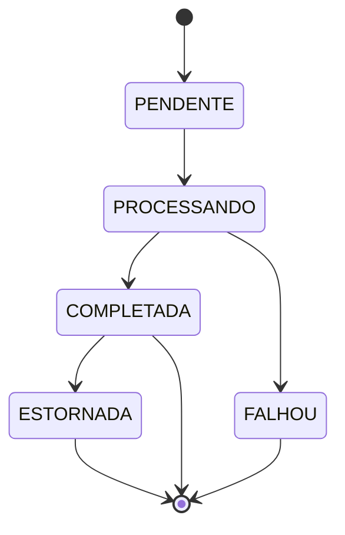

# Domain-Driven Design

O `transaction-processing-api` organiza o domínio em bounded contexts para separar responsabilidades de negócio e manter a evolução dos fluxos transacionais sob controle. O core domain atual é o processamento de transações; conta, auditoria e componentes compartilhados dão suporte às invariantes e à rastreabilidade.

## Bounded Contexts

| Bounded Context  | Pacote                                               | Status       | Responsabilidade                                                                             |
| ---------------- | ---------------------------------------------------- | ------------ | -------------------------------------------------------------------------------------------- |
| Transação        | `com.mekylei.transactionprocessing.transacao`        | Implementado | Core domain. Processa PIX, TED e TEF, controla ciclo de vida da transação e publica eventos. |
| Conta            | `com.mekylei.transactionprocessing.conta`            | Implementado | Supporting domain. Mantém conta, saldo e limite transacional usados no processamento.        |
| Auditoria        | `com.mekylei.transactionprocessing.auditoria`        | Implementado | Supporting domain. Registra dados e eventos auditáveis.                                      |
| Compartilhado    | `com.mekylei.transactionprocessing.compartilhado`    | Implementado | Shared Kernel. Contém value objects, eventos-base, exceções, segurança e utilitários comuns. |
| Mensageria       | `com.mekylei.transactionprocessing.mensageria`       | Implementado | Suporte técnico ao domínio para outbox, roteamento, produção e consumo de eventos.           |
| Observabilidade  | `com.mekylei.transactionprocessing.observabilidade`  | Implementado | Métricas, mascaramento de dados sensíveis, logs e rastreamento.                              |
| Configuração     | `com.mekylei.transactionprocessing.configuracao`     | Implementado | Configuração de Spring, Kafka, segurança, persistência e filtros.                            |
| Infraestrutura   | `com.mekylei.transactionprocessing.infraestrutura`   | Implementado | Adaptadores JPA, entidades e repositórios Spring Data.                                       |
| PIX              | `com.mekylei.transactionprocessing.pix`              | Planejado    | Evolução do domínio específico de pagamentos PIX.                                            |
| TED              | `com.mekylei.transactionprocessing.ted`              | Planejado    | Evolução do domínio específico de transferências TED.                                        |
| TEF              | `com.mekylei.transactionprocessing.tef`              | Planejado    | Evolução do domínio específico de transferências TEF.                                        |
| Cliente          | `com.mekylei.transactionprocessing.cliente`          | Planejado    | Evolução de dados e regras relacionadas a clientes.                                          |
| Integração BACEN | `com.mekylei.transactionprocessing.integracao.bacen` | Planejado    | Integrações futuras com serviços do BACEN.                                                   |
| Integração SPB   | `com.mekylei.transactionprocessing.integracao.spb`   | Planejado    | Integrações futuras com o Sistema de Pagamentos Brasileiro.                                  |
| Integração STR   | `com.mekylei.transactionprocessing.integracao.str`   | Planejado    | Integrações futuras com STR.                                                                 |

## Glossário do Domínio

| Termo               | Definição em linguagem de negócio                                                                                                                                                                                                                | Classe Java correspondente                                                                                |
| ------------------- | ------------------------------------------------------------------------------------------------------------------------------------------------------------------------------------------------------------------------------------------------ | --------------------------------------------------------------------------------------------------------- |
| Transação           | Operação financeira solicitada para movimentar valor entre uma conta de origem e uma conta de destino, usando PIX, TED ou TEF. Consulte os [Fluxos de Negócio](../desenvolvimento/fluxos-negocio.md) para conhecer as regras de cada modalidade. | `com.mekylei.transactionprocessing.transacao.dominio.Transacao`                                           |
| Conta               | Conta bancária de um cliente, com agência, número, tipo e situação operacional.                                                                                                                                                                  | `com.mekylei.transactionprocessing.conta.dominio.Conta`                                                   |
| Saldo               | Valor disponível e valor bloqueado associados a uma conta. Protege a regra de que o saldo disponível não pode ficar negativo.                                                                                                                    | `com.mekylei.transactionprocessing.conta.dominio.Saldo`                                                   |
| Limite transacional | Limite configurado por conta e tipo de transação, usado para validar valor por operação e uso diário.                                                                                                                                            | `com.mekylei.transactionprocessing.conta.dominio.LimiteTransacional`                                      |
| Valor monetário     | Valor financeiro com moeda, normalizado para duas casas decimais e aceito apenas quando positivo.                                                                                                                                                | `com.mekylei.transactionprocessing.compartilhado.dominio.ValorMonetario`                                  |
| Status da transação | Estado de vida da transação: `PENDENTE`, `PROCESSANDO`, `COMPLETADA`, `FALHOU` ou `ESTORNADA`.                                                                                                                                                   | `com.mekylei.transactionprocessing.transacao.dominio.StatusTransacao`                                     |
| Status da conta     | Situação operacional da conta, usada para permitir ou bloquear processamento.                                                                                                                                                                    | `com.mekylei.transactionprocessing.conta.dominio.StatusConta`                                             |
| Tipo de transação   | Modalidade de processamento financeiro: `PIX`, `TED` ou `TEF`.                                                                                                                                                                                   | `com.mekylei.transactionprocessing.compartilhado.dominio.TipoTransacao`                                   |
| Tipo de conta       | Classificação da conta bancária, como `CORRENTE`, `POUPANCA` ou `PAGAMENTO`.                                                                                                                                                                     | `com.mekylei.transactionprocessing.conta.dominio.TipoConta`                                               |
| Ação de auditoria   | Tipo de ação registrada em auditoria: `INSERIR`, `ATUALIZAR` ou `CONSULTAR`.                                                                                                                                                                     | `com.mekylei.transactionprocessing.auditoria.dominio.AcaoAuditoria`                                       |
| `idCorrelacao`      | Identificador usado para rastrear uma requisição, logs e eventos ao longo do fluxo.                                                                                                                                                              | Campo em `Transacao` e contrato `com.mekylei.transactionprocessing.compartilhado.evento.EventoDominio`    |
| `idIdempotencia`    | Identificador usado para deduplicar requisições e evitar que a mesma solicitação processe duas vezes.                                                                                                                                            | Campo em `Transacao` e `com.mekylei.transactionprocessing.compartilhado.idempotencia.IdempotenciaService` |

## Aggregates

### `Transacao`

Aggregate root em `com.mekylei.transactionprocessing.transacao.dominio.Transacao`.

Responsabilidades:

- Representar uma operação financeira processada pelo sistema.
- Manter identidade (`id`), correlação (`idCorrelacao`) e idempotência (`idIdempotencia`).
- Carregar valor, tipo da transação, conta de origem, conta de destino e status.
- Permitir transição de status por meio de `comStatus(StatusTransacao)`.

Eventos de domínio associados:

- `TransacaoIniciadaEvento`
- `TransacaoConcluidaEvento`
- `TransacaoFalhouEvento`
- `TransacaoEstornadaEvento`

Esses eventos implementam `EventoDominio`, usam `tipoAgregado()` igual a `Transacao` e são publicados pela porta `EventoPublicador`.

## Máquina de Estados da Transação

O ciclo de vida de `StatusTransacao` é modelado pelo aggregate `Transacao` por meio de `comStatus(StatusTransacao)`. O fluxo de negócio cria a transação como `PENDENTE`, processa pela strategy do tipo (`PIX`, `TED` ou `TEF`) e finaliza como `COMPLETADA` ou `FALHOU`. O estorno só é permitido para transações `COMPLETADA`.



### `Conta`

Aggregate root em `com.mekylei.transactionprocessing.conta.dominio.Conta`.

Responsabilidades:

- Representar a conta bancária e seu estado operacional.
- Validar se a conta está ativa por meio de `estaAtiva()`.
- Relacionar número da conta, agência, cliente, tipo e status.

Objetos do agregado:

- `Saldo`: representa valores disponíveis e bloqueados da conta. Protege a invariante de saldo não negativo ao debitar e permite crédito para fluxos como estorno.
- `LimiteTransacional`: representa limites por tipo de transação. Valida limite por operação e limite diário, além de atualizar o valor utilizado no dia.

## Value Objects

### `ValorMonetario`

Value object em `com.mekylei.transactionprocessing.compartilhado.dominio.ValorMonetario`.

Responsabilidades:

- Representar valor e moeda.
- Rejeitar valor nulo, valor menor ou igual a zero e moeda nula.
- Normalizar escala monetária para duas casas decimais.
- Oferecer `paraReal(BigDecimal)` para criar valores em BRL.

### `TipoTransacao`

Value object conceitual implementado como enum em `com.mekylei.transactionprocessing.compartilhado.dominio.TipoTransacao`.

Valores suportados:

- `PIX`
- `TED`
- `TEF`

Esse tipo é compartilhado pelos contexts `transacao` e `conta`, sendo usado para escolher a strategy de processamento e validar limites transacionais.

## Domain Events

| Evento                     | Pacote                                                       | Quando é usado                                                                                        |
| -------------------------- | ------------------------------------------------------------ | ----------------------------------------------------------------------------------------------------- |
| `TransacaoIniciadaEvento`  | `com.mekylei.transactionprocessing.transacao.dominio.evento` | Criado em `CriaTransacaoService` após persistir a transação pendente.                                 |
| `TransacaoConcluidaEvento` | `com.mekylei.transactionprocessing.transacao.dominio.evento` | Publicado por `ProcessaTransacaoService` quando a transação termina com `StatusTransacao.COMPLETADA`. |
| `TransacaoFalhouEvento`    | `com.mekylei.transactionprocessing.transacao.dominio.evento` | Publicado por `ProcessaTransacaoService` quando a transação termina com `StatusTransacao.FALHOU`.     |
| `TransacaoEstornadaEvento` | `com.mekylei.transactionprocessing.transacao.dominio.evento` | Publicado no fluxo de estorno para registrar a reversão da transação.                                 |

Todos os eventos implementam `com.mekylei.transactionprocessing.compartilhado.evento.EventoDominio`, carregam `idEvento`, `idAgregado`, `idCorrelacao`, `idIdempotencia`, dados da conta, tipo, valor, moeda e data de ocorrência. Eventos de falha e estorno também carregam o motivo.

## Shared Kernel

O Shared Kernel fica em `com.mekylei.transactionprocessing.compartilhado`.

Conteúdos principais:

- `compartilhado.dominio`: `ValorMonetario` e `TipoTransacao`.
- `compartilhado.evento`: contrato `EventoDominio`.
- `compartilhado.exception`: exceções e tratamento global de erro.
- `compartilhado.idempotencia`: serviço de idempotência.
- `compartilhado.seguranca`: utilitários HMAC e roles.
- `compartilhado.util`: correlação, datas, criptografia e calendário stub.
- `compartilhado.constantes`: constantes HTTP e de problema.
- `compartilhado.adaptador`: adaptadores técnicos compartilhados.

O Shared Kernel deve continuar pequeno e estável, contendo apenas conceitos realmente compartilhados entre contexts.

## Fluxo principal de processamento

Os endpoints reais do controller usam o prefixo `/api/v1/transacoes` e especializam o tipo no caminho:

- `POST /api/v1/transacoes/pix`
- `POST /api/v1/transacoes/ted`
- `POST /api/v1/transacoes/tef`

Fluxo:

```text
POST /api/v1/transacoes/{pix|ted|tef}
        -> TransacaoController
        -> ProcessaTransacaoService
        -> IdempotenciaService
        -> ContaRepository
        -> SaldoService
        -> LimiteService
        -> CriaTransacaoService
        -> EventoPublicador
        -> DominioEventoOutboxPublicador
        -> StrategyResolver
        -> TransacaoStrategy
        -> TransacaoRepository
        -> EventoPublicador
        -> DominioEventoOutboxPublicador
```

Descrição do fluxo:

1. `TransacaoController` recebe a requisição HTTP e define o `TipoTransacao` conforme o endpoint chamado.
2. `ProcessaTransacaoService` verifica idempotência por `IdempotenciaService`.
3. O serviço valida se a conta existe e está ativa por `ContaRepository`.
4. `SaldoService` valida saldo disponível.
5. `LimiteService` valida o limite transacional.
6. `CriaTransacaoService` cria a `Transacao` pendente, persiste pela porta `TransacaoRepository` e publica `TransacaoIniciadaEvento`.
7. `DominioEventoOutboxPublicador` recebe o evento pela porta `EventoPublicador` e grava o evento na outbox.
8. `StrategyResolver` escolhe a `TransacaoStrategy` adequada para `PIX`, `TED` ou `TEF`.
9. A strategy processa a transação e retorna o estado final.
10. Quando a transação é concluída, `SaldoService` debita o saldo e `LimiteService` decrementa o limite utilizado.
11. `TransacaoRepository` atualiza o status final.
12. `ProcessaTransacaoService` publica `TransacaoConcluidaEvento` ou `TransacaoFalhouEvento`.
13. `DominioEventoOutboxPublicador` persiste o evento final na outbox para publicação assíncrona.

## Regras de Negócio por Contexto

### Transação

- A transação nasce com `StatusTransacao.PENDENTE` quando nenhum status é informado no builder de `Transacao`.
- O processamento é especializado por `TipoTransacao` via `StrategyResolver` e `TransacaoStrategy`.
- O débito de saldo e o consumo do limite só são efetivados quando a strategy retorna `StatusTransacao.COMPLETADA`.
- O estorno só é aceito para transações com `StatusTransacao.COMPLETADA`; o fluxo altera o status para `StatusTransacao.ESTORNADA`, credita o valor na conta de origem e publica `TransacaoEstornadaEvento`.
- A idempotência é verificada antes das validações de conta, saldo e limite. Quando `IdempotenciaService` encontra transação com o mesmo `idIdempotencia`, o caso de uso retorna a transação existente e não processa a requisição novamente.

### Conta

- A conta de origem deve existir e estar `StatusConta.ATIVA` para que a transação seja processada. A validação usa `Conta::estaAtiva` em `ProcessaTransacaoService`.
- O saldo disponível nunca pode ficar negativo. A regra aparece no domínio em `Saldo.debitar`, no builder de `Saldo` e na persistência pelas constraints `ck_saldo_disponivel_positivo` e `ck_saldo_bloqueado_positivo`.
- O saldo é validado antes das integrações externas e debitado com lock no fluxo de efetivação.

### Limite Transacional

- O limite é definido por conta e `TipoTransacao`.
- `LimiteTransacional.validar` rejeita valores acima do limite por transação.
- `LimiteTransacional.validar` rejeita operações em que `utilizadoHoje + valor` ultrapassa `limiteDiario`.
- `LimiteTransacional.decrementar` retorna uma nova instância com `utilizadoHoje` incrementado pelo valor aprovado.

### Antifraude

- O antifraude é usado no processamento de `TipoTransacao.TEF`.
- A porta `AntiFraudeGateway` é implementada por `AntiFraudeStubAdapter`.
- O stub aprova automaticamente transações com valor menor ou igual a `antifraude.limite-aprovacao-automatica`.
- Valores acima do threshold configurado são recusados pelo stub, e a strategy de TEF lança `RegraNegocioException` com código `TEF_RECUSADO_ANTIFRAUDE`.

### Auditoria e Rastreabilidade

- Eventos de domínio carregam `idCorrelacao` e `idIdempotencia` para manter rastreabilidade e deduplicação ao longo do fluxo.
- Ações auditáveis usam `AcaoAuditoria` com os valores `INSERIR`, `ATUALIZAR` e `CONSULTAR`.

## Integrations Map

| Bounded Context | Integração externa | Porta ou ponto de integração                                            | Implementação atual                                               | Tipo                   | Observação                                                                                                             |
| --------------- | ------------------ | ----------------------------------------------------------------------- | ----------------------------------------------------------------- | ---------------------- | ---------------------------------------------------------------------------------------------------------------------- |
| Transação / PIX | SPI/BACEN          | `PixTransacaoStrategy.enviaParaSpiBacen` e porta planejada `PixGateway` | Simulação interna na strategy                                     | Stub                   | O fluxo registra log de envio ao SPI/BACEN e conclui a transação; não há adaptador externo concreto para `PixGateway`. |
| Transação / TED | STR                | `TedTransacaoStrategy.enviarParaSistemaTransferenciaReserva`            | Simulação interna na strategy                                     | Stub                   | O fluxo valida dia útil e horário permitido antes de simular envio ao STR.                                             |
| Transação / TED | Calendário BACEN   | `CalendarioStubBacenService`                                            | Serviço local com feriados fixos e móveis                         | Stub                   | Usado para validar dia útil bancário no processamento de TED.                                                          |
| Transação / TEF | Antifraude         | `AntiFraudeGateway`                                                     | `AntiFraudeStubAdapter`                                           | Stub configurável      | Autoriza TEF até `antifraude.limite-aprovacao-automatica` e recusa valores acima do limite configurado.                |
| Mensageria      | Kafka              | `KafkaEventoProdutor`                                                   | `KafkaTemplate` condicionado por `app.eventos.kafka.enabled=true` | Real quando habilitado | Publica eventos gravados na outbox nos tópicos resolvidos por `TransacaoEventoRouter`.                                 |
| Mensageria      | Outbox             | `EventoPublicador` / `DominioEventoOutboxPublicador`                    | Persistência via `OutboxEventoRepository`                         | Real                   | Garante persistência dos eventos de domínio antes da publicação assíncrona.                                            |
| Auditoria       | Banco de dados     | `AuditoriaRepository`                                                   | Adaptador JPA de auditoria                                        | Real                   | Persiste eventos auditáveis com `idCorrelacao` e dados associados à ação.                                              |
