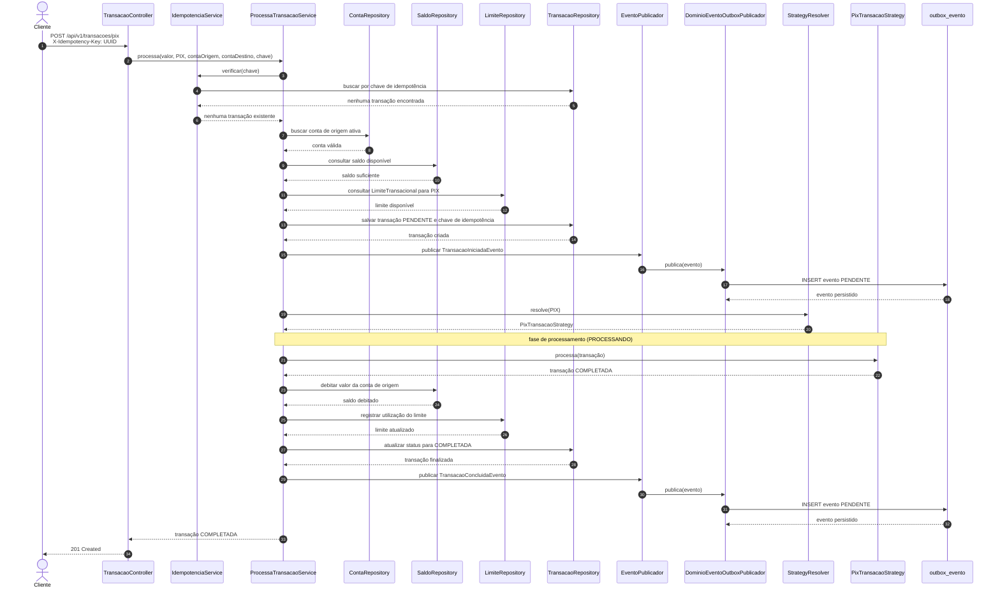
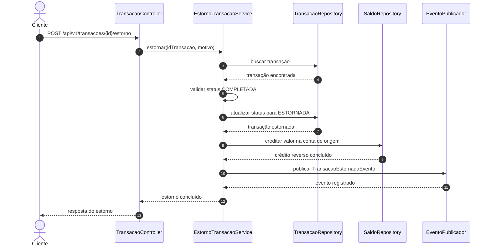

# Fluxo de Processamento de Transação

Este documento descreve o fluxo de processamento das transações PIX, TED e TEF, desde a requisição HTTP até a persistência dos eventos na outbox. O objetivo é explicitar a colaboração entre os componentes da arquitetura hexagonal, as variações de negócio por tipo e o caminho de estorno.

## Fluxo PIX — Caso Nominal

As gravações da transação e dos eventos na outbox participam da mesma fronteira transacional. A publicação no Kafka ocorre posteriormente, de forma assíncrona, a partir dos registros de `outbox_evento`.

## Variações por Tipo de Transação

| Tipo | Restrição adicional | Validação específica |
| --- | --- | --- |
| PIX | Sem restrição de horário. | Limite configurado em `LimiteTransacional`. |
| TED | Apenas em horário bancário, das 06h às 17h BRT. | Fora da janela, retorna HTTP 422 com o código `TED_FORA_DO_HORARIO`. |
| TEF | Entre contas internas, sem restrição de horário. | Valida se a transferência ocorre entre contas internas. |

## Fluxo de Estorno

O estorno somente é permitido para uma transação em estado `COMPLETADA`. A operação altera seu estado para `ESTORNADA`, recompõe o saldo da conta de origem e registra o `TransacaoEstornadaEvento` para publicação pela outbox.

## Referências

- [Domain-Driven Design](ddd.md)
- [Kafka e Outbox](../mensageria/kafka-outbox.md)
- [Autenticação e Autorização](../seguranca/autenticacao-autorizacao.md)
