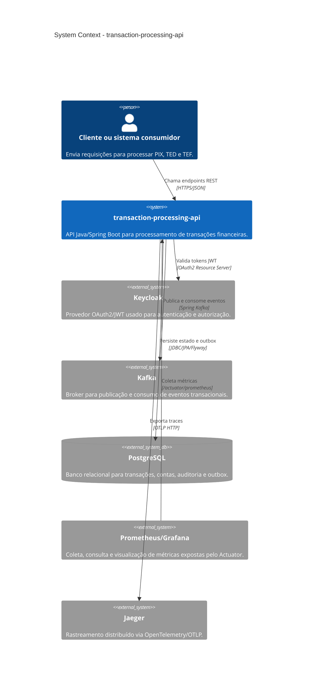

# Visão Geral

## Descrição do sistema

O `transaction-processing-api` é uma API para processamento de transações financeiras com suporte a PIX, TED e TEF. O sistema centraliza o recebimento das requisições transacionais, valida idempotência, conta de origem, saldo e limite transacional, executa a estratégia de processamento adequada ao tipo da operação e registra eventos de domínio para rastreabilidade e publicação assíncrona via outbox.

O objetivo de negócio é processar pagamentos e transferências com consistência transacional, integridade de saldos, auditoria operacional e observabilidade suficiente para investigação de falhas, latência e comportamento dos fluxos críticos.

No estado atual, o núcleo implementado está concentrado nos bounded contexts `transacao`, `conta`, `auditoria` e `compartilhado`. Os pacotes `pix`, `ted`, `tef`, `cliente`, `integracao/bacen`, `integracao/spb` e `integracao/str` existem como áreas planejadas para evolução do domínio e das integrações.

## Contexto do sistema

## Dependências externas reais

| Dependência | Uso no projeto |
| --- | --- |
| Keycloak | Emissor e JWKS OAuth2/JWT configurados por `OAUTH2_ISSUER_URI` e `OAUTH2_JWKS_URI`. |
| Kafka | Broker de eventos, com tópicos de transações iniciadas, concluídas, falhas, estornadas e DLQ. |
| PostgreSQL | Banco relacional principal, acessado por Spring Data JPA e migrado por Flyway. |
| Prometheus/Grafana | Prometheus coleta métricas em `/actuator/prometheus`; Grafana consome essas métricas para dashboards. |
| Jaeger | Backend de traces recebido via endpoint OTLP configurado por `OTLP_TRACING_ENDPOINT`. |

## Tecnologias e versões

| Tecnologia | Versão/configuração |
| --- | --- |
| Java | 21 |
| Spring Boot | 4.0.6 |
| PostgreSQL | Driver `42.7.11`; imagem local `postgres:16-alpine` no `docker-compose.yml` |
| Flyway | 12.6.2 |
| Spring Kafka | Versão gerenciada pelo Spring Boot 4.0.6 |
| OAuth2 Resource Server | Versão gerenciada pelo Spring Boot 4.0.6 |
| Spring Data JPA | Versão gerenciada pelo Spring Boot 4.0.6 |
| Spring Web MVC | Versão gerenciada pelo Spring Boot 4.0.6 |
| Spring Validation | Versão gerenciada pelo Spring Boot 4.0.6 |
| Spring Actuator | Versão gerenciada pelo Spring Boot 4.0.6 |
| Micrometer Prometheus Registry | Versão gerenciada pelo Spring Boot 4.0.6 |
| OpenTelemetry/OTLP | Versão gerenciada pelo Spring Boot 4.0.6 |
| springdoc-openapi | 3.0.3 |
| Bucket4j | 8.19.0 |
| Logstash Logback Encoder | 9.0 |
| ArchUnit | 1.4.2 |
| JaCoCo | 0.8.15 |
