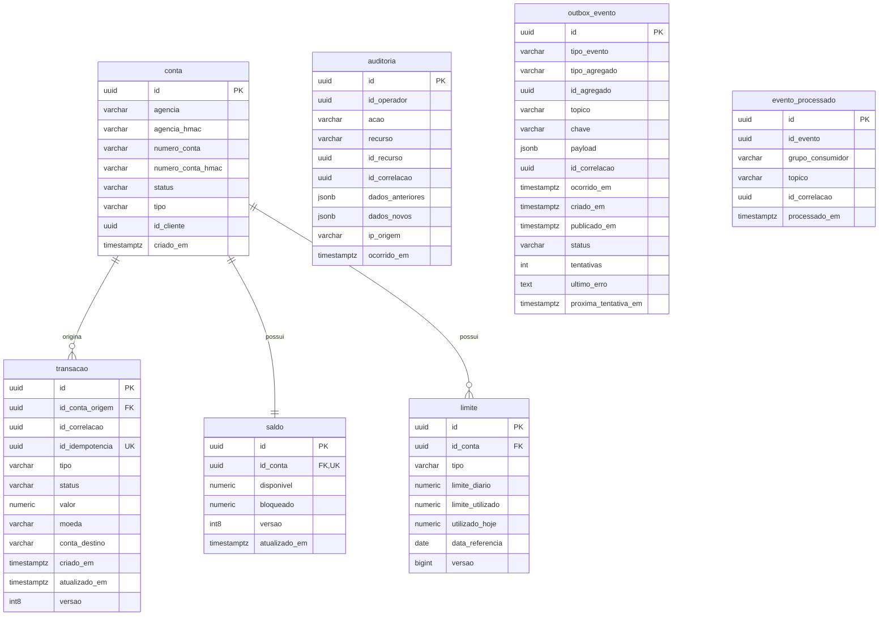

# Modelo de Dados

Este documento descreve o modelo relacional do `transaction-processing-api` em PostgreSQL 16, versionado por Flyway. O escopo é documental: os nomes de tabelas, colunas, constraints e índices seguem as migrations em `src/main/resources/db/migration`.

## Diagrama ER

As tabelas `auditoria`, `outbox_evento` e `evento_processado` não possuem foreign keys declaradas nas migrations atuais. Elas guardam identificadores de correlação, recurso, agregado ou evento para rastreabilidade e deduplicação, mas sem acoplamento físico com as demais tabelas.

## Tabelas

### `conta`

Representa uma conta bancária usada como origem de transações.

| Coluna | Descrição |
| --- | --- |
| `id` | Identificador único da conta. |
| `agencia` | Agência criptografada em repouso. |
| `agencia_hmac` | Blind index HMAC da agência para busca sem descriptografar o valor. |
| `numero_conta` | Número da conta criptografado em repouso. |
| `numero_conta_hmac` | Blind index HMAC do número da conta para busca determinística. |
| `status` | Situação operacional da conta, por exemplo ativa ou bloqueada conforme domínio. |
| `tipo` | Tipo da conta, como corrente, poupança ou pagamento conforme domínio. |
| `id_cliente` | Identificador do cliente proprietário da conta. |
| `criado_em` | Data e hora de criação do registro. |

### `transacao`

Registra a operação financeira solicitada e seu ciclo de vida.

| Coluna | Descrição |
| --- | --- |
| `id` | Identificador único da transação. |
| `id_conta_origem` | FK para `conta(id)`, indicando a conta debitada. |
| `id_correlacao` | Identificador de rastreabilidade entre requisição, logs e eventos. |
| `id_idempotencia` | Chave de idempotência para evitar processamento duplicado da mesma solicitação. |
| `tipo` | Tipo da transação, como `PIX`, `TED` ou `TEF`. |
| `status` | Estado da transação no fluxo de processamento. |
| `valor` | Valor financeiro da operação, com precisão `numeric(15, 2)`. |
| `moeda` | Código da moeda em três caracteres. |
| `conta_destino` | Conta de destino informada na transação. |
| `criado_em` | Data e hora de criação. |
| `atualizado_em` | Data e hora da última atualização. |
| `versao` | Versão usada pelo JPA para locking otimista. |

### `saldo`

Mantém os valores disponíveis e bloqueados de uma conta.

| Coluna | Descrição |
| --- | --- |
| `id` | Identificador único do saldo. |
| `id_conta` | FK única para `conta(id)`, garantindo um saldo por conta. |
| `disponivel` | Valor disponível para débito, com check `disponivel >= 0`. |
| `bloqueado` | Valor bloqueado, com check `bloqueado >= 0`. |
| `versao` | Versão usada pelo JPA para locking otimista. |
| `atualizado_em` | Data e hora da última atualização. |

### `limite`

Controla limites transacionais por conta e tipo de transação.

| Coluna | Descrição |
| --- | --- |
| `id` | Identificador único do limite. |
| `id_conta` | FK para `conta(id)`. |
| `tipo` | Tipo de transação ao qual o limite se aplica. |
| `limite_diario` | Valor máximo permitido no dia para o tipo de transação. |
| `limite_utilizado` | Valor de referência já utilizado pelo limite. |
| `utilizado_hoje` | Valor consumido na `data_referencia`. |
| `data_referencia` | Data de apuração do consumo diário. |
| `versao` | Versão adicionada na V4 para locking otimista. |

### `auditoria`

Armazena registros auditáveis de ações executadas no sistema.

| Coluna | Descrição |
| --- | --- |
| `id` | Identificador único do evento de auditoria. |
| `id_operador` | Identificador do operador responsável pela ação. |
| `acao` | Ação auditada, como inserção, atualização ou consulta conforme domínio. |
| `recurso` | Nome lógico do recurso auditado. |
| `id_recurso` | Identificador do recurso afetado, quando aplicável. |
| `id_correlacao` | Identificador para rastrear a ação no fluxo distribuído. |
| `dados_anteriores` | Snapshot anterior em JSONB, quando houver. |
| `dados_novos` | Snapshot novo em JSONB, quando houver. |
| `ip_origem` | IP de origem associado à ação. |
| `ocorrido_em` | Data e hora em que a ação ocorreu. |

A migration cria rules `auditoria_no_update` e `auditoria_no_delete` para impedir alterações e remoções diretas na tabela.

### `outbox_evento`

Implementa o padrão Outbox para publicação confiável de eventos de domínio.

| Coluna | Descrição |
| --- | --- |
| `id` | Identificador único do evento na outbox. |
| `tipo_evento` | Tipo do evento de domínio serializado. |
| `tipo_agregado` | Tipo lógico do agregado relacionado ao evento. |
| `id_agregado` | Identificador do agregado relacionado. |
| `topico` | Tópico Kafka de destino. |
| `chave` | Chave usada na publicação do evento. |
| `payload` | Conteúdo do evento em JSONB. |
| `id_correlacao` | Identificador de rastreabilidade do fluxo. |
| `ocorrido_em` | Data e hora em que o evento de domínio ocorreu. |
| `criado_em` | Data e hora em que o registro foi persistido na outbox. |
| `publicado_em` | Data e hora da publicação, quando concluída. |
| `status` | Estado de publicação, como `PENDENTE`, `ENVIADO` ou `FALHOU`. |
| `tentativas` | Quantidade de tentativas de publicação, com check `tentativas >= 0`. |
| `ultimo_erro` | Último erro registrado durante a publicação. |
| `proxima_tentativa_em` | Data e hora em que o evento pode ser tentado novamente. |

### `evento_processado`

Registra eventos já processados por consumidores Kafka para garantir idempotência no consumo.

| Coluna | Descrição |
| --- | --- |
| `id` | Identificador único do processamento. |
| `id_evento` | Identificador do evento consumido. |
| `grupo_consumidor` | Grupo consumidor responsável pelo processamento. |
| `topico` | Tópico de origem do evento. |
| `id_correlacao` | Identificador de rastreabilidade do fluxo. |
| `processado_em` | Data e hora do processamento. |

A constraint `uq_evento_processado_evento_grupo` garante que o mesmo evento não seja processado duas vezes pelo mesmo grupo consumidor.

## Índices

| Índice ou constraint | Tabela | Colunas | Justificativa |
| --- | --- | --- | --- |
| `idx_conta_numero_hmac_conta` | `conta` | `numero_conta_hmac` | Permite buscar conta por número usando blind index HMAC, sem consultar o dado criptografado. |
| `idx_conta_agencia_hmac_conta` | `conta` | `agencia_hmac` | Permite filtros por agência usando blind index HMAC. |
| `idx_transacao_id_correlacao` | `transacao` | `id_correlacao` | Acelera consultas de rastreabilidade de uma requisição ponta a ponta. |
| `uq_transacao_id_idempotencia` | `transacao` | `id_idempotencia` | Garante unicidade da chave de idempotência no banco. |
| `idx_transacao_id_idempotencia` | `transacao` | `id_idempotencia where id_idempotencia is not null` | Índice parcial para localizar transações por idempotência sem indexar registros nulos. |
| `uq_saldo_id_conta` | `saldo` | `id_conta` | Garante a regra de um saldo por conta e favorece consulta direta por conta. |
| `idx_limite_id_conta_tipo` | `limite` | `id_conta`, `tipo` | Suporta a consulta do limite aplicável a uma conta e modalidade de transação. |
| `idx_auditoria_recurso_id_recurso` | `auditoria` | `recurso`, `id_recurso`, `ocorrido_em desc` | Acelera investigação por recurso auditado, mantendo os eventos mais recentes primeiro. |
| `idx_auditoria_id_operador` | `auditoria` | `id_operador`, `ocorrido_em desc` | Acelera trilhas de auditoria por operador. |
| `idx_auditoria_id_correlacao` | `auditoria` | `id_correlacao` | Permite cruzar auditoria com logs, transações e eventos do mesmo fluxo. |
| `idx_auditoria_ocorrido_em` | `auditoria` | `ocorrido_em desc` | Favorece consultas temporais e listagens recentes de auditoria. |
| `idx_outbox_evento_status_proxima_tentativa` | `outbox_evento` | `status`, `proxima_tentativa_em`, `criado_em` | Suporta o scheduler de publicação, que busca eventos elegíveis por status e próxima tentativa. |
| `idx_outbox_evento_topico` | `outbox_evento` | `topico`, `criado_em` | Acelera consultas operacionais por tópico e ordem de criação. |
| `idx_outbox_evento_agregado` | `outbox_evento` | `tipo_agregado`, `id_agregado` | Permite rastrear eventos relacionados a um agregado de domínio. |
| `uq_evento_processado_evento_grupo` | `evento_processado` | `id_evento`, `grupo_consumidor` | Impede reprocessamento do mesmo evento pelo mesmo grupo consumidor. |
| `idx_evento_processado_grupo` | `evento_processado` | `grupo_consumidor`, `processado_em desc` | Favorece auditoria operacional por consumidor, com os processamentos recentes primeiro. |
| `idx_evento_processado_id_correlacao` | `evento_processado` | `id_correlacao` | Permite rastrear o consumo de eventos por correlação. |

## Estratégia de Locking

### Locking otimista

O locking otimista é feito por coluna `versao` nas entidades versionadas pelo JPA:

- `transacao.versao`: protege atualizações de status e demais alterações concorrentes da transação.
- `saldo.versao`: protege atualizações concorrentes de saldo.
- `limite.versao`: adicionada na V4 para evitar perda de atualização no consumo de limite diário.

No JPA, essas colunas são mapeadas com `@Version`. Quando duas transações tentam atualizar a mesma linha a partir da mesma versão, apenas a primeira atualização confirma; a segunda falha por conflito de versão e deve ser tratada pela camada de aplicação.

### Locking pessimista

O locking pessimista é usado nos pontos em que a aplicação precisa serializar alterações de valor ou seleção de trabalho:

- `SaldoJpaRepository.findByIdContaForUpdate`: bloqueia a linha de `saldo` da conta durante débito, crédito ou validação crítica.
- `LimiteJpaRepository.findByIdContaAndTipoForUpdate`: bloqueia a linha de `limite` da conta e tipo durante consumo do limite.
- `OutboxEventoJpaRepository.buscarParaPublicacao`: bloqueia eventos elegíveis para publicação, evitando que múltiplos workers publiquem o mesmo evento simultaneamente.

Na prática, `LockModeType.PESSIMISTIC_WRITE` equivale ao uso de `SELECT ... FOR UPDATE` no banco. A outbox também usa hint de lock para seleção concorrente de lotes, permitindo que workers concorrentes ignorem registros já bloqueados quando o provedor JPA traduz essa configuração para o dialeto do PostgreSQL.

## Estratégia de Criptografia

Os campos sensíveis de `conta` são protegidos por duas camadas complementares:

| Campo de negócio | Coluna criptografada | Coluna de busca |
| --- | --- | --- |
| Agência | `agencia` | `agencia_hmac` |
| Número da conta | `numero_conta` | `numero_conta_hmac` |

A coluna criptografada é preenchida pelo `CriptografiaConverter`, que usa `AES/GCM/NoPadding`, chave de 256 bits configurada em `app.criptografia.chave`, IV aleatório de 12 bytes por criptografia e armazenamento em Base64 no formato `IV || ciphertext`.

Como AES-GCM com IV aleatório não produz o mesmo texto cifrado para o mesmo valor, as buscas não devem usar `agencia` ou `numero_conta`. Para consulta determinística, a aplicação grava HMAC-SHA256 nas colunas `agencia_hmac` e `numero_conta_hmac`, tratadas como blind indexes e indexadas no PostgreSQL.

Essa estratégia evita expor os valores sensíveis em texto claro no banco e ainda preserva consultas eficientes por agência ou número de conta. A rotação de chaves deve considerar tanto a chave de criptografia quanto a chave de HMAC, pois alteração de qualquer uma delas muda a capacidade de descriptografar ou localizar registros existentes.

## Histórico das Migrations

As datas abaixo refletem o histórico Git dos arquivos de migration no repositório.

| Versão | Arquivo | Descrição | Data |
| --- | --- | --- | --- |
| V1 | `V1__tabelas_iniciais.sql` | Criação de `conta`, `transacao`, `saldo` e `limite`, com FKs, checks, idempotência, HMAC indexes e versionamento inicial de `transacao` e `saldo`. | 2026-05-29 |
| V2 | `V2__auditoria.sql` | Criação de `auditoria`, rules contra update/delete e índices de consulta por recurso, operador, correlação e data. | 2026-05-27 |
| V3 | `V3__mensageria.sql` | Criação de `outbox_evento` e `evento_processado`, com índices para publicação, rastreabilidade e idempotência de consumo. | 2026-06-01 |
| V4 | `V4__limite_versao.sql` | Adição da coluna `versao` em `limite` para locking otimista. | 2026-06-02 |

## Seed de Dados de Teste

O seed de dados de teste deve ser mantido no arquivo `seed-db/seed.sql`.

Esse script é a referência para popular dados locais ou de testes manuais, como contas, saldos, limites e transações de exemplo. Ele deve respeitar o modelo versionado pelas migrations, incluindo:

- gravação dos campos sensíveis criptografados em `conta`;
- preenchimento dos blind indexes `agencia_hmac` e `numero_conta_hmac`;
- criação de apenas um registro de `saldo` por conta;
- criação de limites compatíveis com `id_conta` e `tipo`;
- uso de identificadores de correlação e idempotência válidos para testes de rastreabilidade.
