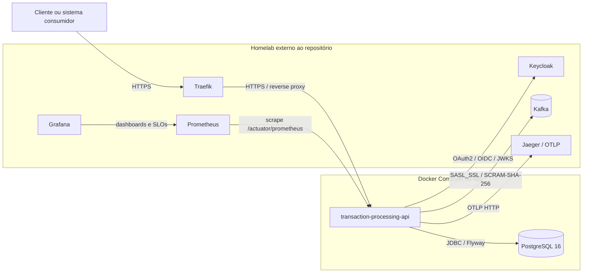

# Visão Geral da Infraestrutura

Este documento descreve a infraestrutura usada pela `transaction-processing-api`, separando o que é provisionado pelo `docker-compose.yml` deste repositório do que roda no homelab local gerenciado separadamente.

## Topologia

## Separação de responsabilidades

### Serviços do `docker-compose.yml` da app

O Compose deste repositório sobe somente os serviços necessários para executar a API com banco local:

- `app`: container da `transaction-processing-api`, exposto na porta `8080`.
- `postgres-transacao`: PostgreSQL 16, exposto no host pela porta `5433` e usado pela aplicação na rede Docker pela porta `5432`.

### Serviços do homelab

Os serviços de segurança, mensageria, observabilidade e borda rodam fora deste repositório:

- Keycloak, como Authorization Server OAuth2/OIDC.
- Kafka, como broker de eventos transacionais.
- Prometheus e Grafana, para métricas, dashboards e SLOs.
- Jaeger, para rastreamento distribuído via OTLP.
- Traefik, como reverse proxy com terminação TLS.

## Serviços

| Serviço              | Função                                                                  | Onde roda      | Obrigatório ou opcional                                                                         |
| -------------------- | ----------------------------------------------------------------------- | -------------- | ----------------------------------------------------------------------------------------------- |
| `app`                | API Java/Spring Boot de processamento de transações.                    | Compose da app | Obrigatório                                                                                     |
| `postgres-transacao` | Banco relacional principal, migrado por Flyway.                         | Compose da app | Obrigatório                                                                                     |
| Keycloak             | Authorization Server OAuth2/OIDC e emissor dos JWTs validados pela API. | Homelab        | Obrigatório para chamadas autenticadas                                                          |
| Kafka                | Broker de eventos para outbox, consumidores e DLQ.                      | Homelab        | Opcional; habilitado por `EVENTOS_KAFKA_ENABLED=true`                                           |
| Prometheus           | Coleta métricas da API em `/actuator/prometheus`.                       | Homelab        | Opcional para execução; recomendado para operação                                               |
| Grafana              | Dashboards de SLO e métricas transacionais.                             | Homelab        | Opcional para execução; recomendado para operação                                               |
| Jaeger / OTLP        | Coleta e visualização de traces distribuídos exportados por OTLP HTTP.  | Homelab        | Opcional em `dev`; esperado no perfil `prod` quando `OTLP_TRACING_ENDPOINT` estiver configurado |
| Traefik              | Reverse proxy, roteamento HTTPS e terminação TLS no homelab.            | Homelab        | Opcional para execução local direta; recomendado para acesso HTTPS no homelab                   |
