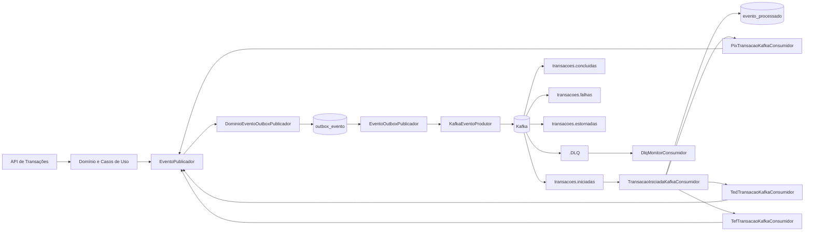

# Kafka e Outbox

Este documento descreve a arquitetura de mensageria do `transaction-processing-api`, baseada em Apache Kafka e Outbox Pattern. O objetivo é garantir publicação assíncrona e rastreável dos eventos de transação sem acoplar o domínio ao broker.

O Kafka é acessado via `SASL_SSL` com `SCRAM-SHA-256` e truststore, usando o broker `kafka.lab.home:9094` como padrão. A publicação dos eventos passa pela tabela `outbox_evento`; consumidores Kafka processam eventos confirmados e usam a tabela `evento_processado` para idempotência de consumo.

## Visão Geral



Responsabilidades principais:

- `DominioEventoOutboxPublicador`: implementa a porta `EventoPublicador`, resolve tópico e chave e persiste o evento na outbox.
- `EventoOutboxPublicador`: job agendado que busca eventos `PENDENTE` ou `FALHOU` elegíveis e tenta publicá-los em lote.
- `KafkaEventoProdutor`: envia o payload para Kafka com confirmação síncrona limitada por timeout.
- `TransacaoIniciadaKafkaConsumidor`: consome `transacoes.iniciadas`, aplica idempotência e roteia para o consumidor especializado por tipo de transação.
- `DlqMonitorConsumidor`: monitora tópicos com padrão `.*\.DLQ` e registra alerta em log.

## Fluxo Completo Outbox

1. Um caso de uso de transação cria um evento de domínio, como `TransacaoIniciadaEvento`, `TransacaoConcluidaEvento`, `TransacaoFalhouEvento` ou `TransacaoEstornadaEvento`.
2. O caso de uso chama a porta `EventoPublicador`.
3. `DominioEventoOutboxPublicador` resolve o tópico por `TransacaoEventoRouter` e usa `idAgregado` como chave Kafka.
4. O evento é persistido em `outbox_evento` com status `PENDENTE`, payload `jsonb`, tópico, chave, `id_correlacao`, `ocorrido_em`, `criado_em`, `tentativas = 0` e `proxima_tentativa_em`.
5. O job `EventoOutboxPublicador` executa a cada `EVENTOS_OUTBOX_INTERVALO_PUBLICACAO_MS`, com padrão de 5s.
6. O job busca até `EVENTOS_OUTBOX_LOTE_PUBLICACAO` eventos elegíveis, com padrão de 50, ordenados por criação.
7. `KafkaEventoProdutor` publica no Kafka e aguarda confirmação por até `EVENTOS_OUTBOX_TIMEOUT_ENVIO_MS`, com padrão de 5s.
8. Em caso de sucesso, a outbox é atualizada para `PUBLICADO`, com `publicado_em` preenchido e `ultimo_erro` limpo.
9. Em caso de falha de publicação, a outbox é atualizada para `FALHOU`, incrementa `tentativas`, grava `ultimo_erro` e agenda nova tentativa após `EVENTOS_OUTBOX_INTERVALO_REPROCESSAMENTO`, com padrão de 30s.
10. O consumidor Kafka lê a mensagem publicada. Em `transacoes.iniciadas`, `TransacaoIniciadaKafkaConsumidor` valida o payload, registra o evento em `evento_processado` e chama o consumidor especializado `PixTransacaoKafkaConsumidor`, `TedTransacaoKafkaConsumidor` ou `TefTransacaoKafkaConsumidor`.
11. O processamento especializado atualiza a transação, aplica débito de saldo e limite quando finalizada com sucesso, e publica novos eventos de domínio de conclusão ou falha de volta na outbox.

A semântica operacional é at-least-once: se o Kafka confirmar a publicação, mas a atualização do status da outbox falhar antes do commit, o evento pode ser reenviado na próxima execução. Por isso, consumidores devem ser idempotentes.

## Tópicos e Mensagens

| Tópico | Evento | Produtor | Consumidor | Formato da mensagem |
| --- | --- | --- | --- | --- |
| `transacoes.iniciadas` | `TransacaoIniciada` | `EventoOutboxPublicador` via `KafkaEventoProdutor` | `TransacaoIniciadaKafkaConsumidor` | JSON com `idEvento`, `idAgregado`, `idCorrelacao`, `idIdempotencia`, `idContaOrigem`, `contaDestino`, `tipo`, `valor`, `moeda`, `ocorridoEm`, `tipoEvento`, `tipoAgregado`. |
| `transacoes.concluidas` | `TransacaoConcluida` | `EventoOutboxPublicador` via `KafkaEventoProdutor` | Consumidores externos ou futuros consumidores internos | JSON com `idEvento`, `idAgregado`, `idCorrelacao`, `idIdempotencia`, `idContaOrigem`, `tipo`, `valor`, `moeda`, `ocorridoEm`, `tipoEvento`, `tipoAgregado`. |
| `transacoes.falhas` | `TransacaoFalhou` | `EventoOutboxPublicador` via `KafkaEventoProdutor` | Consumidores externos ou futuros consumidores internos | JSON com os campos de `TransacaoConcluida` e o campo adicional `motivo`. |
| `transacoes.estornadas` | `TransacaoEstornada` | `EventoOutboxPublicador` via `KafkaEventoProdutor` | Consumidores externos ou futuros consumidores internos | JSON com os campos de `TransacaoConcluida` e o campo adicional `motivo`. |
| `<topico>.DLQ` | Mensagem original que falhou no consumo | `DeadLetterPublishingRecoverer` | `DlqMonitorConsumidor` | Mesmo payload da mensagem original, publicado no tópico de DLQ correspondente. |

Exemplo lógico de payload para `transacoes.iniciadas`:

```json
{
  "idEvento": "00000000-0000-0000-0000-000000000001",
  "idAgregado": "00000000-0000-0000-0000-000000000002",
  "idCorrelacao": "00000000-0000-0000-0000-000000000003",
  "idIdempotencia": "00000000-0000-0000-0000-000000000004",
  "idContaOrigem": "00000000-0000-0000-0000-000000000005",
  "contaDestino": "12345-6",
  "tipo": "PIX",
  "valor": 100.50,
  "moeda": "BRL",
  "ocorridoEm": "2026-06-17T10:00:00Z",
  "tipoEvento": "TransacaoIniciada",
  "tipoAgregado": "Transacao"
}
```

A chave Kafka é o `idAgregado` da transação. Isso favorece ordenação por transação dentro da mesma partição.

## Configuração Kafka

As variáveis abaixo configuram a conexão e o comportamento da mensageria. Valores sensíveis devem ser fornecidos pelo ambiente ou por mecanismo seguro de secrets; não devem ser versionados.

| Variável | Finalidade | Padrão |
| --- | --- | --- |
| `EVENTOS_KAFKA_ENABLED` | Habilita produtor, consumidores e error handler Kafka. | `false` em `application.yml`; `true` em `application-prod.yml` |
| `KAFKA_BOOTSTRAP_SERVERS` | Lista de brokers Kafka. | `kafka.lab.home:9094` |
| `KAFKA_USERNAME` | Usuário SCRAM. | Sem padrão |
| `KAFKA_PASSWORD` | Senha SCRAM. | Sem padrão |
| `KAFKA_SSL_TRUSTSTORE_LOCATION` | Caminho da truststore usada para validar o broker. | Sem padrão |
| `KAFKA_SSL_TRUSTSTORE_PASSWORD` | Senha da truststore. | Sem padrão |
| `KAFKA_SSL_TRUSTSTORE_TYPE` | Tipo da truststore. | `PKCS12` em `application.yml`; `JKS` como fallback em `application-prod.yml` |
| `EVENTOS_OUTBOX_LOTE_PUBLICACAO` | Quantidade máxima de eventos publicados por execução do job. | `50` |
| `EVENTOS_OUTBOX_INTERVALO_PUBLICACAO_MS` | Intervalo do scheduler de publicação da outbox. | `5000` |
| `EVENTOS_OUTBOX_INTERVALO_REPROCESSAMENTO` | Atraso para nova tentativa de eventos `FALHOU` na outbox. | `30s` |
| `EVENTOS_OUTBOX_TIMEOUT_ENVIO_MS` | Tempo máximo de espera pela confirmação do envio Kafka. | `5000` |
| `EVENTOS_KAFKA_DLQ_MAX_TENTATIVAS` | Máximo de tentativas do error handler antes da DLQ. | `3` |
| `EVENTOS_KAFKA_DLQ_INTERVALO_REPROCESSAMENTO` | Intervalo entre tentativas do consumidor antes da DLQ. | `10s` |

Configurações Kafka efetivas:

| Propriedade | Valor |
| --- | --- |
| `spring.kafka.security.protocol` | `SASL_SSL` |
| `spring.kafka.properties.sasl.mechanism` | `SCRAM-SHA-256` |
| `spring.kafka.ssl.trust-store-type` | `PKCS12` por padrão |
| `spring.kafka.producer.acks` | `all` |
| `spring.kafka.producer.properties.enable.idempotence` | `true` |
| `spring.kafka.producer.properties.max.in.flight.requests.per.connection` | `5` |
| `spring.kafka.consumer.enable-auto-commit` | `false` |
| `spring.kafka.consumer.auto-offset-reset` | `earliest` |
| `spring.kafka.consumer.properties.isolation.level` | `read_committed` |

Os tópicos de domínio são configurados em `app.eventos.topicos`:

| Propriedade | Valor padrão |
| --- | --- |
| `app.eventos.topicos.transacoes-iniciadas` | `transacoes.iniciadas` |
| `app.eventos.topicos.transacoes-concluidas` | `transacoes.concluidas` |
| `app.eventos.topicos.transacoes-falhas` | `transacoes.falhas` |
| `app.eventos.topicos.transacoes-estornadas` | `transacoes.estornadas` |

O sufixo de DLQ é configurado por `app.eventos.kafka.dlq.sufixo-topico` e usa `.DLQ` por padrão.

## Dead Letter Queue

A DLQ é configurada por `KafkaConfig` usando `DefaultErrorHandler` e `DeadLetterPublishingRecoverer`. Quando uma mensagem falha no consumo e a exceção chega ao error handler, o Kafka tenta reprocessar com intervalo fixo de `EVENTOS_KAFKA_DLQ_INTERVALO_REPROCESSAMENTO`, padrão de 10s. Depois do limite configurado por `EVENTOS_KAFKA_DLQ_MAX_TENTATIVAS`, padrão de 3, a mensagem é publicada no tópico original acrescido do sufixo configurado.

O sufixo padrão é `.DLQ`, então:

| Tópico original | DLQ |
| --- | --- |
| `transacoes.iniciadas` | `transacoes.iniciadas.DLQ` |
| `transacoes.concluidas` | `transacoes.concluidas.DLQ` |
| `transacoes.falhas` | `transacoes.falhas.DLQ` |
| `transacoes.estornadas` | `transacoes.estornadas.DLQ` |

`DlqMonitorConsumidor` usa `@KafkaListener(topicPattern = ".*\\.DLQ", groupId = "dlq-monitor-consumer")` para registrar alertas. O log inclui tópico, chave, offset, partição e payload truncado em 500 caracteres para reduzir exposição e ruído operacional.

Para reprocessar uma mensagem em DLQ:

1. Identifique o tópico original removendo o sufixo `.DLQ`.
2. Analise `payload`, chave, offset, partição e erro correlacionado nos logs da aplicação.
3. Corrija a causa raiz antes de reenfileirar a mensagem, como payload inválido, transação inexistente, erro transitório de banco ou indisponibilidade de dependência.
4. Republique o payload original no tópico original, mantendo a mesma chave Kafka sempre que possível.
5. Acompanhe o `idEvento` e o `idCorrelacao` para confirmar se o consumidor processou ou ignorou por idempotência.

Mensagens já registradas em `evento_processado` para o mesmo `idEvento` e `grupo_consumidor` serão ignoradas no reprocessamento. Para casos excepcionais em que seja necessário forçar novo consumo, a intervenção na tabela `evento_processado` deve ser tratada como operação manual controlada, com auditoria e validação do impacto de negócio.

## Idempotência de Consumo

A idempotência do consumidor é centralizada em `EventoProcessadoService`, que usa a porta `EventoProcessadoRepository` e a tabela `evento_processado`.

Estrutura da tabela:

| Coluna | Uso |
| --- | --- |
| `id` | Identificador técnico do registro. |
| `id_evento` | Identificador do evento recebido do payload. |
| `grupo_consumidor` | Grupo consumidor responsável pelo processamento. |
| `topico` | Tópico de origem da mensagem. |
| `id_correlacao` | Identificador de rastreabilidade ponta a ponta. |
| `processado_em` | Data e hora em que o evento foi registrado como processado. |

A constraint `uq_evento_processado_evento_grupo` impede duplicidade para o mesmo par `id_evento` e `grupo_consumidor`.

Fluxo no `TransacaoIniciadaKafkaConsumidor`:

1. O consumidor lê o payload e extrai `tipo`, `idEvento`, `idCorrelacao` e `idAgregado`.
2. Chama `EventoProcessadoService.registrarSeNaoProcessado`.
3. Se já existir registro para o mesmo `idEvento` e `grupo_consumidor`, o evento é considerado duplicado e não é processado novamente.
4. Se o registro for criado com sucesso, o evento segue para o consumidor especializado por `tipo`.
5. Concorrência é protegida pela constraint única; se dois consumidores tentarem registrar o mesmo evento ao mesmo tempo, apenas um deles prossegue.

O grupo consumidor atual de `transacoes.iniciadas` é `transacao-iniciada-consumidor`.

## Configurações de Resiliência

| Mecanismo | Configuração | Efeito |
| --- | --- | --- |
| Confirmação forte do produtor | `acks=all` | O Kafka só confirma o envio após replicação conforme configuração do tópico e do broker. |
| Produtor idempotente | `enable.idempotence=true` | Reduz risco de duplicidade causada por retries do produtor. |
| Ordem por conexão | `max.in.flight.requests.per.connection=5` | Mantém compatibilidade com produtor idempotente e limita requisições simultâneas por conexão. |
| Chave por transação | `idAgregado` como chave Kafka | Preserva ordenação por transação quando os eventos caem na mesma partição. |
| Outbox persistente | `outbox_evento` com status `PENDENTE`, `PUBLICADO`, `FALHOU` | Evita perda de eventos entre commit de negócio e publicação assíncrona. |
| Reprocessamento da outbox | `EVENTOS_OUTBOX_INTERVALO_REPROCESSAMENTO=30s` | Eventos com falha de publicação voltam a ficar elegíveis para envio. |
| Timeout de envio | `EVENTOS_OUTBOX_TIMEOUT_ENVIO_MS=5000` | Evita bloqueio indefinido do job ao aguardar confirmação Kafka. |
| Retry de consumidor | `EVENTOS_KAFKA_DLQ_INTERVALO_REPROCESSAMENTO=10s` e `EVENTOS_KAFKA_DLQ_MAX_TENTATIVAS=3` | Tenta recuperar falhas transitórias antes de enviar para DLQ. |
| DLQ automática | `<topico>.DLQ` | Isola mensagens que não puderam ser consumidas após as tentativas configuradas. |
| Idempotência de consumo | `evento_processado` | Protege consumidores contra duplicidade em cenários at-least-once. |

Essas configurações não eliminam a possibilidade de entrega duplicada, que é inerente ao modelo at-least-once. A garantia prática do sistema vem da combinação de outbox persistente, produtor idempotente, chave estável por agregado, retries controlados, DLQ e idempotência explícita no consumidor.
