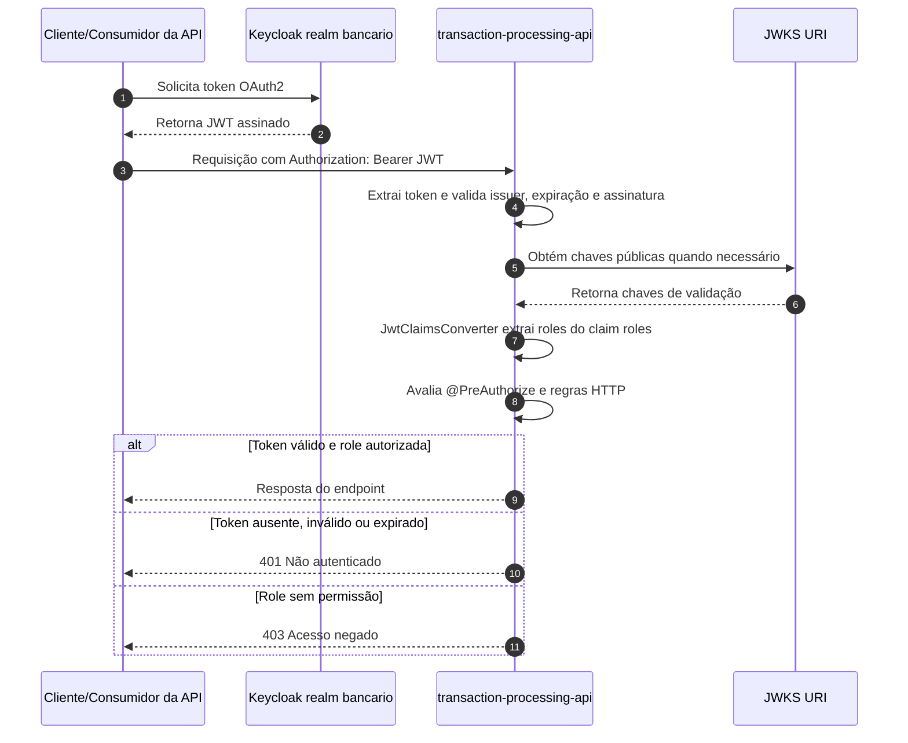

# Autenticação e Autorização

Este documento descreve o modelo de segurança da API: autenticação por OAuth2 Resource Server com JWT, autorização baseada em roles, proteção de dados sensíveis em repouso, rate limiting, mascaramento de logs e transporte seguro.

## Modelo de Autenticação

A API atua como OAuth2 Resource Server. O provedor de identidade é o Keycloak, no realm `bancario`. Clientes chamam os endpoints protegidos enviando um JWT no header `Authorization: Bearer <token>`.

As URIs de validação são configuradas por variável de ambiente:

| Configuração | Variável | Uso |
| --- | --- | --- |
| `spring.security.oauth2.resourceserver.jwt.jwks-uri` | `OAUTH2_JWKS_URI` | Localiza o conjunto de chaves públicas usado para validar a assinatura do JWT. |
| `spring.security.oauth2.resourceserver.jwt.issuer-uri` | `OAUTH2_ISSUER_URI` | Valida o emissor esperado do token. |

O `JwtClaimsConverter` lê o claim `roles` do JWT e converte cada valor para authorities Spring Security com prefixo `ROLE_`. Exemplo: `CLIENTE` vira `ROLE_CLIENTE`.

Respostas de autenticação e autorização:

| Cenário | Componente | Status | Comportamento |
| --- | --- | --- | --- |
| Token ausente, inválido ou expirado | `ApiAutenticacaoEntryPoint` | `401 Unauthorized` | Retorna body JSON com título `Não autenticado` e detalhe `Token ausente, inválido ou expirado.` |
| Token válido, mas sem permissão | `ApiAcessoNegadoHandler` | `403 Forbidden` | Retorna body JSON com título `Acesso negado`, detalhe `Sem permissão para executar esta operação.` e `codigoErro` igual a `ACESSO_NEGADO`. |

Endpoints públicos configurados em `SecurityConfig`:

| Endpoint | Acesso |
| --- | --- |
| `/actuator/health` | Público |
| `/actuator/info` | Público |
| `/v3/api-docs/**` | Público |
| `/swagger-ui/**` | Público |
| `/swagger-ui.html` | Público |
| `/actuator/prometheus` | Requer authority `ROLE_METRICAS.LEITURA` |

## Autorização RBAC

A autorização da API transacional usa RBAC com cinco roles de negócio:

| Role | Descrição | Uso esperado |
| --- | --- | --- |
| `CLIENTE` | Cliente autenticado do canal digital. | Iniciar transações próprias e consultar status. |
| `OPERADOR` | Operador de atendimento ou operação. | Processar e consultar transações dentro do escopo operacional. |
| `GERENTE` | Perfil gerencial. | Processar, consultar e executar estorno. |
| `ADMIN` | Administração da plataforma. | Acesso administrativo às operações transacionais protegidas. |
| `SERVICO_INTERNO` | Integrações internas autorizadas. | Chamadas serviço-a-serviço para processamento e consulta. |

Permissões por endpoint:

| Método | Endpoint | Permissões |
| --- | --- | --- |
| `POST` | `/api/v1/transacoes/pix` | `CLIENTE`, `OPERADOR`, `GERENTE`, `ADMIN`, `SERVICO_INTERNO` |
| `POST` | `/api/v1/transacoes/ted` | `CLIENTE`, `OPERADOR`, `GERENTE`, `ADMIN`, `SERVICO_INTERNO` |
| `POST` | `/api/v1/transacoes/tef` | `CLIENTE`, `OPERADOR`, `GERENTE`, `ADMIN`, `SERVICO_INTERNO` |
| `GET` | `/api/v1/transacoes/{id}` | `CLIENTE`, `OPERADOR`, `GERENTE`, `ADMIN`, `SERVICO_INTERNO` |
| `POST` | `/api/v1/transacoes/{id}/estorno` | `GERENTE`, `ADMIN` |

As permissões são aplicadas com `@PreAuthorize` no `TransacaoController`. O token precisa conter uma das roles esperadas no claim `roles`; a aplicação converte essas roles para o padrão `ROLE_<NOME>`.

## Proteção de Dados em Repouso

Dados bancários sensíveis de conta são protegidos com duas camadas complementares: HMAC-SHA256 para busca segura e AES-256-GCM para confidencialidade em repouso.

| Campo lógico | Coluna | Proteção | Finalidade |
| --- | --- | --- | --- |
| Agência | `agencia` | AES-256-GCM via `CriptografiaConverter` | Armazenar o valor criptografado e descriptografar apenas na camada de persistência. |
| Agência | `agencia_hmac` | HMAC-SHA256 via `HmacService` | Permitir busca/indexação sem expor o valor original. |
| Número da conta | `numero_conta` | AES-256-GCM via `CriptografiaConverter` | Armazenar o valor criptografado e descriptografar apenas na camada de persistência. |
| Número da conta | `numero_conta_hmac` | HMAC-SHA256 via `HmacService` | Permitir busca/indexação sem expor o valor original. |

O `CriptografiaConverter` usa `AES/GCM/NoPadding`, chave de 256 bits em Base64 configurada por `APP_CRIPTOGRAFIA_CHAVE`, IV aleatório de 12 bytes por operação e tag de autenticação de 128 bits. O valor gravado no banco segue o formato `Base64(IV || ciphertext)`.

O `HmacService` usa `HmacSHA256` com chave configurada por `APP_HMAC_CHAVE`. Antes de calcular o HMAC, o valor é normalizado com `trim()` e conversão para maiúsculas. As colunas `_hmac` devem ser tratadas como blind indexes: permitem comparação determinística, mas não devem ser usadas como substituto de criptografia.

## Rate Limiting

O rate limiting é aplicado pelo `RateLimitFilter` com Bucket4j. A chave do bucket é o IP do cliente; quando a aplicação está atrás de proxy ou load balancer, o filtro respeita o primeiro IP do header `X-Forwarded-For`.

| Perfil | Configuração | Limite |
| --- | --- | --- |
| Default | `app.rate-limit.requests-per-minute` ou `RATE_LIMIT_REQUISICOES_POR_MINUTO` | `60` requisições por minuto |
| `dev` | `application-dev.yml` | `300` requisições por minuto |

Quando o limite é excedido, a API não encaminha a requisição para o endpoint. O `RateLimitResposta` retorna:

| Item | Valor |
| --- | --- |
| Status HTTP | `429 Too Many Requests` |
| Header | `Retry-After: 60` |
| Título | `Limite excedido` |
| Detalhe | `Limite de requisições excedido. Tente novamente em instantes.` |
| `codigoErro` | `LIMITE_EXCEDIDO` |

## Mascaramento de Logs

O mascaramento reduz exposição acidental de dados sensíveis em logs de aplicação, mensagens, stacktraces, JSON e headers. A implementação central usa `DadosSensiveisMasker`, com integração por `LogMascaramentoConverter`, `JsonMascaradoProvider` e estratégias de mascaramento.

Os padrões funcionais de mascaramento são organizados em seis grupos principais: documentos, contas bancárias, agência, valores monetários, credenciais em headers e segredos em JSON.

Estratégias registradas:

| Tipo | Estratégia | Escopo |
| --- | --- | --- |
| `MESSAGE` | `MensagemMascaradaStrategy` | Mensagens textuais de log. |
| `STACKTRACE` | `StacktraceMascaradoStrategy` | Stacktraces e mensagens de exceção. |
| `JSON` | `JsonMascaradoStrategy` | Campos sensíveis em payloads JSON. |
| `HEADER` | `HeaderMascaradoStrategy` | Headers HTTP, especialmente credenciais. |

Padrões sensíveis cobertos pela política de logs:

| Dado | Exemplos de padrão | Máscara esperada |
| --- | --- | --- |
| CPF | `123.456.789-09`, `12345678909` | Mantém início e dígitos finais, por exemplo `123.***.***-09`. |
| CNPJ | `12.345.678/0001-90`, `12345678000190` | É tratado como documento sensível e mascarado quando aparecer em logs. |
| Conta bancária | `numeroConta=123456-7`, campos `conta` e `numeroConta` | Substitui o valor por `****`. |
| Agência | `agencia=0001` | Substitui o valor por `****`. |
| Valor monetário | `valor=1500.00`, `saldo=2500.00`, `amount=1500.00`, `R$ 10000,00` | Substitui o valor por `****`. |
| JWT no header | `Authorization: Bearer <jwt>` | Mantém o prefixo e substitui o token por `****`. |
| Token ou segredo em JSON | Campos `token`, `authorization`, `senha`, `password`, `secret` | Substitui o campo por `****`. |

Logs de segurança em nível detalhado podem revelar decisões de autenticação e autorização. O perfil `dev` permite `org.springframework.security: DEBUG` para diagnóstico local; em produção, esse nível não deve ser habilitado.

## TLS e Transporte Seguro

O transporte seguro é obrigatório nas integrações externas de identidade e mensageria.

### Keycloak HTTPS

O Keycloak deve ser acessado por HTTPS. No ambiente de desenvolvimento, as configurações padrão apontam para:

| Item | Valor |
| --- | --- |
| Issuer | `https://keycloak.lab.home/realms/bancario` |
| JWKS | `https://keycloak.lab.home/realms/bancario/protocol/openid-connect/certs` |

A confiança TLS do Keycloak usa a root CA do `step-ca`. A JVM ou o ambiente de execução da aplicação deve confiar nessa CA para validar corretamente o certificado apresentado pelo Keycloak.

### Kafka SASL_SSL

O Kafka usa canal criptografado e autenticação SCRAM:

| Configuração | Valor |
| --- | --- |
| `spring.kafka.security.protocol` | `SASL_SSL` |
| `spring.kafka.properties.sasl.mechanism` | `SCRAM-SHA-256` |
| Usuário | `KAFKA_USERNAME` |
| Senha | `KAFKA_PASSWORD` |
| Truststore | `KAFKA_SSL_TRUSTSTORE_LOCATION` |
| Senha da truststore | `KAFKA_SSL_TRUSTSTORE_PASSWORD` |
| Tipo da truststore | `KAFKA_SSL_TRUSTSTORE_TYPE` |

A truststore deve conter a cadeia de confiança necessária para validar os brokers Kafka. Em `application.yml`, o tipo padrão é `PKCS12`; em `application-prod.yml`, o fallback configurado é `JKS`.
